# Ibom_Air-Airline_Operations_Analytics_Dashboard_2025
A production-grade, 16-page Power BI report delivering full-year operational intelligence across flight performance, route analytics, passenger traffic, fleet utilisation, fuel cost management, cargo operations, and revenue intelligence — built for airline leadership and commercial teams.

### Table of Contents

* Project Overview
* Business Problem
* Key Insights
* Dashboard Visuals & Deep Insights
    * Route Performance — Flights by Route
    * Route Performance — Flights by Day of Week
    * Capacity Utilisation
    * Load Factor by Origin & Destination
    * Fleet Availability
    * CRJ 900 Fleet Deep-Dive
    * A220 Fleet Deep-Dive
    * Fleet Cross-Tabular — Flights by Aircraft & Route
    * Fleet Cross-Tabular — Fleet Type by Route
    * Fleet Cross-Tabular — Monthly Aircraft Utilisation
    * Fleet Cross-Tabular — Aircraft Operating Days
    * Fuel Uplift Analysis
    * Fuel Breakdown — Cost vs Revenue
    * Fuellers Information
    * Aircraft & Fuel Utilisation
    * Cargo Operations
    * Flight Delays Analysis
* Data Model & DAX
* Technical Stack
* Author

### Project Overview
|Detail            |Info                                                      |
|------------------|----------------------------------------------------------|
|Tool              |Microsoft Power BI Desktop                                |
|Domain            |Aviation / Airline Operations                             |
|Year              |2025 (Full Year — Jan to Dec)                             |
|Report pages      |16 analytical views                                       |
|Aircraft types    |CRJ 900 · A220                                            |
|Routes covered    |20 origin-destination pairs                               |
|Currency          |Nigerian Naira (NGN)                                      |
|Data areas        |Operations · Commercial · Fleet · Fuel · Cargo · Revenue  |

### Business Problem
Airlines operate in one of the most data-intensive industries in the world — thousands of flights, millions of passengers, billions in fuel spend — yet operational data often sits in disconnected systems. Without a unified view, leadership cannot:

* Identify why flights are delayed and on which routes the problem is worst
* Know whether the fleet is being used efficiently or if aircraft are sitting idle
* Track how rising fuel prices are eating into ticket revenue in real time
* Understand which routes, cabin classes, and sales channels drive the most value
* Make proactive scheduling and procurement decisions backed by data

This dashboard was designed to close that gap — a single source of truth, no coding required, interactive for every level of the organisation.

### Key Insights & Findings
These are the headline findings surfaced by the dashboard — the kind of insight that drives real decisions:
1. Technical faults are the leading cause of delays — not weather or fuel
Out of 2,149 delayed flights across 2025, technical issues caused 550 incidents — the single largest category, more than weather (283) and Lagos station congestion (395) combined. The ABV–LOS and LOS–ABV trunk routes each recorded over 300 delay incidents individually, making them the highest-risk corridors for operational disruption.

_Implication: A targeted maintenance review on the CRJ 900 fleet — which handles the majority of high-frequency routes — could meaningfully reduce the delay count and improve the 81% OTP rate._

2. December OTP collapsed to 58% — the network's weakest month
While the annual OTP averaged 81%, December fell to 58% — the worst performance of the year by a wide margin. Schedule reliability in December also dropped to 68%. The combination of high cancellations (6 in December) and rising delays signals a systemic peak-season capacity or crew management challenge.

_Implication: Advance crewing plans, maintenance buffers, and slot management are needed before Q4 2026 to prevent a repeat._

3. The A220 is punching above its weight commercially
With only 2 aircraft in the fleet, the A220 generated ₦59bn in revenue — 43% of total revenue — while operating just 3,183 flights compared to the CRJ 900's 8,135. The A220 carried 363,730 passengers at higher per-passenger yields, and both aircraft (CDA and CDB) delivered near-equal contributions (51%/49%).

_Implication: Expanding the A220 fleet or deploying it more strategically on high-yield routes (ABV–LOS, LOS–PHC) could significantly improve revenue per available seat._

4. Class Y full-fare economy is the single biggest revenue driver
Class Y (unrestricted economy) generated ₦47.1bn — 32.6% of all ticket revenue despite not being the highest volume booking class. By contrast, Class B (the next revenue contributor at 19.4%, ₦28bn) shows that the top two classes alone account for over half of all ticket revenue.

_Implication: Fare class mix management is critical. Diluting Y-class inventory with discount classes costs disproportionately more than volume gains suggest._

5. Internet sales now account for 72% of all revenue
₦104.6bn was collected through the internet channel — 72.1% of total salespoint revenue. Nigerian airport stations contributed 11.9% (₦17.3bn), and travel agencies 7.8% (₦11.3bn). The mobile app, despite being a direct channel, generated only 1.2% (₦1.76bn).

_Implication: The mobile app is significantly underperforming relative to its strategic potential. A UX and marketing investment in the app could capture a meaningful share of the internet channel's volume at lower distribution cost._

6. ABV–LOS is the undisputed backbone of the network
The ABV–LOS / LOS–ABV route pair operated 2,778 flights across the year — 24.5% of all operated flights — and offered 334,000 seats, more than double the next largest route (LOS–QUO at 182K). It is the highest-volume, highest-capacity, and highest-delay route simultaneously.

_Implication: Any disruption on ABV–LOS has an outsized network effect. Operational resilience planning (spare aircraft positioning, crew standby) should be centred here first._

7. No-show rate of 7% represents recoverable revenue leakage
With 974,805 total bookings and only 905,079 passengers flown, approximately 69,726 booked seats went unflown — a 7% no-show rate. At an average ticket value, this represents hundreds of millions in revenue dilution that resale or overbooking strategy could partially recover.

_Implication: Reviewing the overbooking policy on high-demand routes and strengthening the ancillary penalties strategy (₦948M captured in 2025) could convert no-shows from a cost centre into a revenue buffer._

8. ACC–LOS / LOS–ACC load factors average 52–54%

_Implication: Review route economics; risk of continued loss-making_

9. December cargo fell 34% despite peak season

_Implication: Commercial gap — festive cargo strategy needed_

10. LOS–ABV delay rate 26% vs 19% network average

_Implication: Dedicated ground operations review for LOS–ABV turnaround_

### Dashboard Visuals & Deep Insights
#### Route Performance — Flights by Route

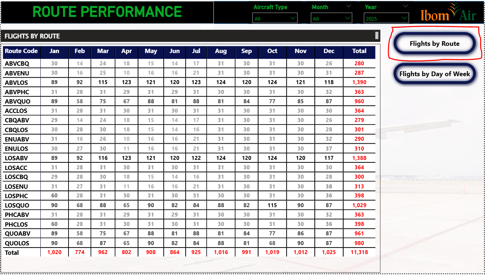

Monthly flight frequency per origin-destination pair across all 20 routes for the full year, enabling scheduling teams to spot seasonality patterns, frequency gaps, and volume distribution.

#### Insights surfaced from this visual:

* ABV–LOS is the undisputed trunk route with 1,390 flights and near-uniform frequency of ~120 flights per month — the most consistent scheduling pattern in the network.
* February was the weakest month across all routes with the network dipping to just 774 total flights, roughly 24% below January's 1,020. Nearly every route shows its lowest monthly count in February, confirming a calendar-driven seasonality dip that should inform fleet maintenance scheduling.
* LOS–QUO (1,029 flights) and QUO–LOS (980 flights) are the second-busiest route pair, but the asymmetry — 49 more outbound flights from Lagos — hints at demand imbalance worth investigating for yield management.
* October is the standout peak month with 1,019 total flights, only narrowly behind January. The network operates near its structural capacity ceiling across Q3–Q4.
* ABV–CBQ (280) and CBQ–ABV (279) are the lowest-frequency routes, with volumes less than 20% of the trunk route. These are likely marginal routes that require close revenue-per-seat monitoring to justify continued scheduling.

#### Route Performance — Flights by Day of Week

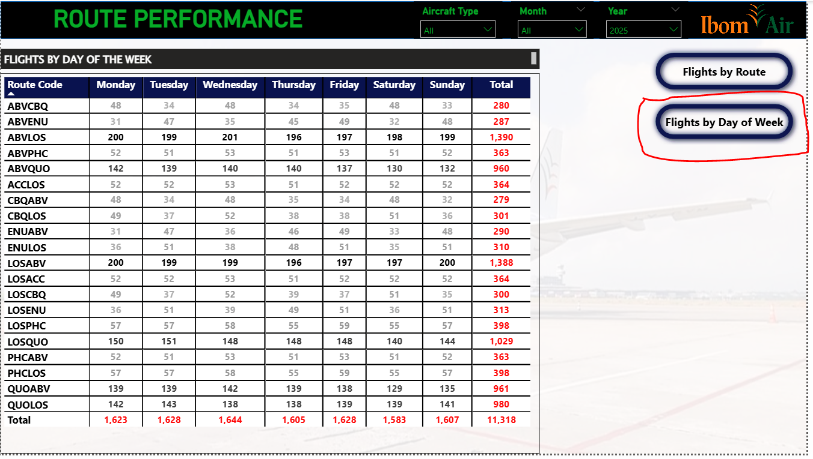

Cross-tab of all 20 routes vs. 7 days of the week, revealing which days carry the highest operational load and where scheduling asymmetries exist.

#### Insights surfaced from this visual:
* Wednesday is the network's peak day (1,644 flights), closely followed by Tuesday and Friday. This mid-week concentration is consistent with corporate travel patterns dominating the Ibom Air network.
* Saturday is the lightest day with just 1,583 flights — 61 fewer than Wednesday. For a leisure-heavy weekend, this suppression likely reflects conscious scheduling rather than low demand, presenting a potential upside if weekend load factors justify additional rotations.
* ABV–LOS and LOS–ABV show near-perfect daily balance (~196–201 flights per day), which is exceptional operational discipline — the kind of consistency that minimises rotational positioning costs.
* ABV–CBQ and CBQ–ABV display highly uneven day distribution: Monday and Wednesday see 48 flights each, while Tuesday drops to just 34 and Friday to 35. This pattern is irregular and may reflect aircraft positioning constraints at Calabar (CBQ).
* ABV–ENU / ENU–ABV pattern is inverted: Tuesday (47/47) and Thursday (45/46) are peak days, unlike the rest of the network. This suggests Enugu routes serve a different customer segment, possibly government or education-related travel.

#### Capacity Utilisation

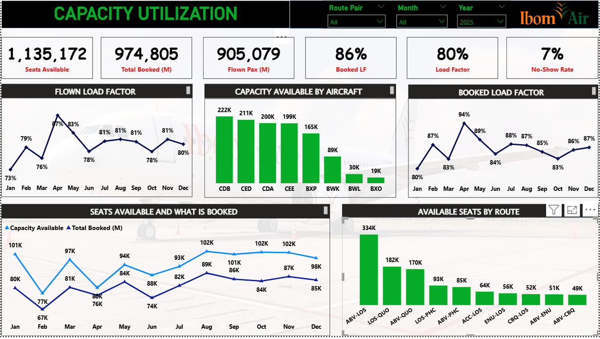

Full-year comparison of seats available vs. bookings and passengers flown, with monthly load factor trends, capacity by aircraft, booked load factor trend, and available seats by route.

#### Insights surfaced from this visual:

* 80% flown load factor on 1.135 million available seats is a commercially healthy result, sitting above the typical industry breakeven threshold of ~75–77% for short-haul operations.
* Booked load factor of 86% vs. flown load factor of 80% confirms a 6-percentage-point leakage gap — the 7% no-show rate translates to approximately 69,726 seats paid for but not flown. At even a conservative average fare of ₦15,000, this is over ₦1bn in potential overbooking/yield recovery.
* CDB is the largest capacity contributor at 222K seats, edging CED (211K), CDA (200K), and CEE (199K). The near-equal distribution across these four tail numbers reflects a deliberate utilisation strategy rather than heavy reliance on any single aircraft.
* BWL (30K) and BXO (19K) are dramatically underutilised compared to peers. Both aircraft appear to have operated for only partial years — BWL until March and BXO until February based on the operating days data — which explains the low cumulative seat count.
* February capacity hit a 12-month low at 67K booked vs. 77K available — the widest gap between supply and bookings, confirming February as the softest demand month and the optimal window for heavy aircraft maintenance.
* ABV–LOS dominates route capacity at 334K seats — double the second-largest route (LOS–QUO at 182K). Any capacity disruption on ABV–LOS has an immediate and outsized network impact.

#### Load Factor by Origin & Destination

Full 12-month load factor percentages for every one of the 20 origin-destination pairs, with a network total row. This is the most granular demand intelligence view in the dashboard.

#### Insights surfaced from this visual:

* ABV–LOS (88%) and LOS–ABV (88%) are the highest-performing routes by annual load factor, confirming that demand on the trunk route consistently fills capacity. These routes rarely dip below 80% even in weak months.
* LOS–PHC (80%), LOS–QUO (84%), and PHC–LOS (85%) are the next-strongest routes, all performing above the network average — the PHC corridor is clearly a commercially robust secondary hub.
* ACC–LOS (52%) and LOS–ACC (54%) are the weakest routes by a wide margin. The Accra route consistently underperforms — no month exceeds 68% on ACC–LOS, and the route dropped to 43% in March. This is a significant commercial red flag. The route is either incorrectly priced, poorly marketed, or structurally unable to compete on this international corridor.
* April was the strongest month across the network at 87% total load factor, coinciding with Easter travel peak. This is the highest single-month figure of the year.
* December declined to 80% — the second-weakest month (after January's 73%), confirming Q4 tail-off. Notably, LOS–PHC hit 95% in December while LOS–QUO hit 97%, suggesting domestic holiday travel concentrates on specific corridors rather than lifting the whole network.
* ABV–CBQ (68%) and CBQ–ABV (70%) are the lowest-performing domestic routes after Accra — worth scrutinising for frequency rationalisation.
* January is the weakest month at 73% total — an important planning baseline. Network-wide, only 2 routes exceeded 85% in January (CBQLOS at 90%, LOSABV at 85%), while several dropped to the 47–63% range.

#### Fleet Availability

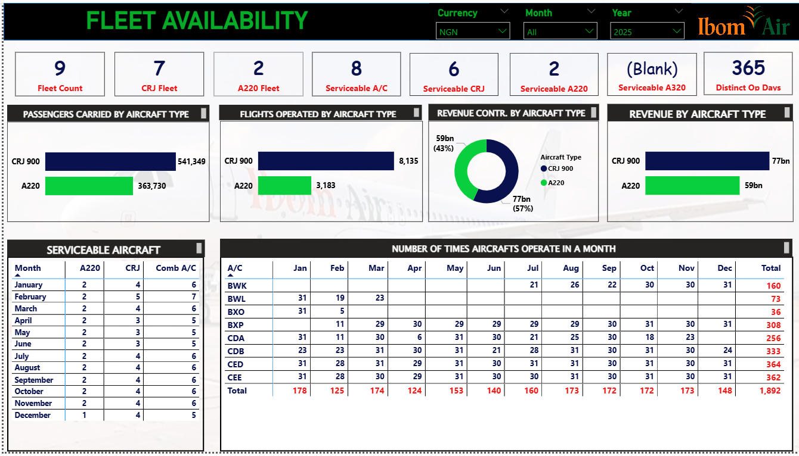

Fleet count, serviceability split by aircraft type, flights and passengers by type, revenue contribution by type, monthly serviceable aircraft count, and individual aircraft operating days per month.

#### Insights surfaced from this visual:

* The A220 is the revenue efficiency champion. Two aircraft generating ₦59bn (43% of total revenue) while operating only 3,183 flights (28% of total) means the A220 earns significantly more per flight than the CRJ 900 — a powerful argument for fleet expansion.
* The CRJ 900 carries 60% of passengers (541,349) but generates only 57% of revenue (₦77bn), despite operating 72% of all flights (8,135). The revenue-per-passenger ratio strongly favours the A220.
* 8 out of 9 aircraft were serviceable throughout most of the year, with the combined serviceability dropping to 5 only in April and May — confirming a period of maintenance concentration that correlates with the April load factor dip.
* 365 distinct operating days confirms zero non-operating calendar days in 2025. The fleet never had a full day offline as a combined unit — a strong maintenance performance indicator.
* December shows only 1 A220 serviceable (CDA was offline) while CDB continued solo. This A220 capacity reduction in the peak December period partially explains why certain high-demand routes still underperformed despite compressed capacity.
* BWK entered service in July (first appearance in the monthly table), while BWL and BXO were retired or transferred by Q2. BXP entered mid-February. This significant fleet transition mid-year adds complexity to year-on-year comparisons.

#### CRJ 900 Fleet Deep-Dive

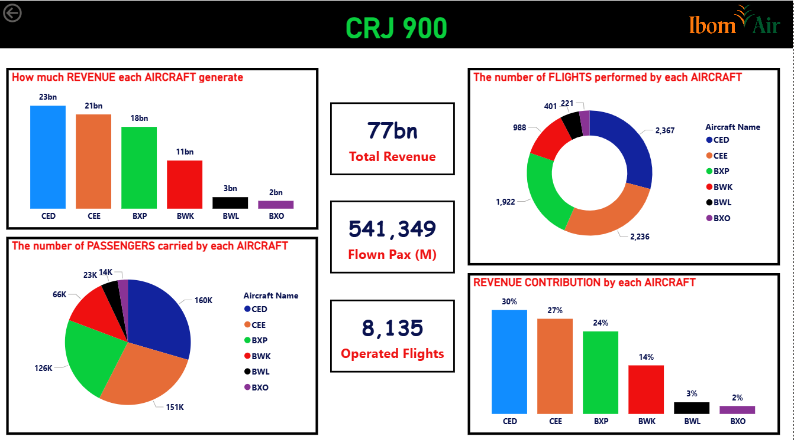

Revenue generated, passengers carried, flights operated, and revenue contribution percentage — broken down by each CRJ 900 tail number (CED, CEE, BXP, BWK, BWL, BXO).

#### Insights surfaced from this visual:

* CED is the top-performing CRJ 900 aircraft generating ₦23bn (30% of CRJ revenue) across 2,367 flights — the highest operated count in the entire fleet including A220s.
* CEE is a close second at ₦21bn (27%) with 2,236 flights. Together, CED and CEE account for 57% of CRJ revenue while operating 57% of CRJ flights — a near-perfect proportionality confirming consistent yield per flight.
* BXP (₦18bn, 24%, 1,922 flights) is the third-ranking CRJ and operated for 11 months (February–December), meaning its per-month performance is marginally below CED and CEE.
* BWK (₦11bn, 14%, 988 flights) operated only from July onwards (6 months) yet generated 14% of CRJ revenue — a higher revenue rate per flight (₦11.1M/flight) compared to CEE (₦9.4M/flight) and CED (₦9.7M/flight), suggesting BWK is deployed on more lucrative routes or time slots.
* BWL (₦3bn, 3%, 401 flights) and BXO (₦2bn, 2%, 221 flights) operated for only 3 months and 2 months respectively. These are transitional aircraft — their low contribution is a function of limited operating time, not poor per-flight economics.
* CRJ passenger distribution mirrors revenue distribution exactly: CED carries the most (160K), CEE second (151K), BXP third (126K) — reinforcing that revenue differences are driven by flight frequency rather than yield variation between aircraft.

#### A220 Fleet Deep-Dive

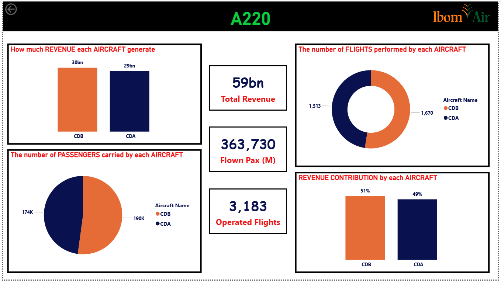

Revenue, passengers, flights, and contribution split between the two A220 tail numbers — CDB and CDA.

#### Insights surfaced from this visual:

* CDB slightly leads CDA across all metrics: ₦30bn vs ₦29bn revenue, 1,670 vs 1,513 flights, 190K vs 174K passengers, 51% vs 49% revenue share.
* The near 50/50 split is a deliberate operational decision — Ibom Air has balanced both A220s as evenly as possible across the year, minimising single-aircraft dependency risk on high-value routes.
* CDB's higher flight count (157 more flights than CDA) with proportionally higher revenue confirms similar yield per flight between the two aircraft — around ₦17.9M per flight for CDB vs ₦19.2M for CDA. Interestingly, CDA generates slightly more revenue per flight despite fewer total flights, suggesting CDA is scheduled on more premium or longer sectors.
* Combined A220 performance: ₦59bn from 3,183 flights = ₦18.5M average revenue per flight, compared to ₦9.5M per flight for the CRJ 900 fleet. The A220 generates nearly double the revenue per flight of the CRJ 900 — the single most important strategic insight in this dashboard for fleet planning.
* 363,730 passengers carried at an average of ~114 passengers per flight, versus 80 passengers per flight for the CRJ 900 — consistent with the A220's larger cabin configuration.

#### Fleet Cross-Tabular — Flights by Aircraft & Route

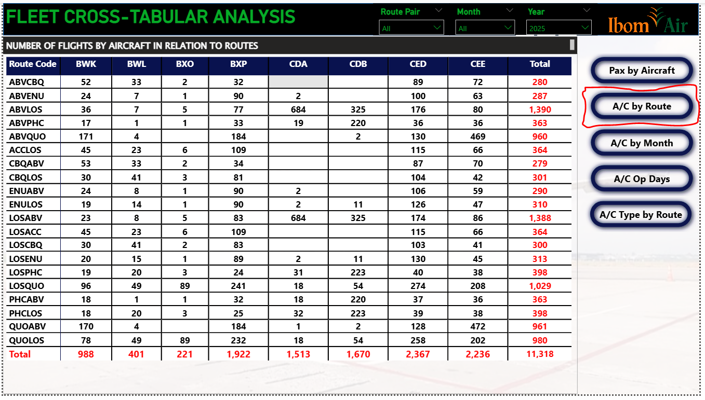

A complete cross-tab matrix of every aircraft tail number vs. every route — showing exactly how many flights each aircraft operated on each route across the full year.

#### Insights surfaced from this visual:

* CDA and CDB (A220s) are concentrated on just a few routes: ABV–LOS (684 flights each = 1,368 combined), LOS–ABV (684+325 = ~1,009 each side), LOS–PHC (31+223), ABV–PHC (19+220). The A220 is clearly reserved for the highest-frequency, highest-demand corridors.
* CED is the most versatile aircraft, appearing on every single route including international (ACC–LOS: 115 flights), Calabar (CBQ–ABV: 87, CBQ–LOS: 104), and Enugu routes. CED acts as the network's workhorse with 2,367 total route assignments.
* BXP is the second-most-distributed aircraft (1,922 flights) with strong presence on ABV–QUO (184), QUO–LOS (232), LOS–QUO (241) — the Abuja-Enugu-Kano corridor. BXP appears purpose-deployed on secondary hub routes.
* BWL and BXO appear on very few routes (BWL: 8 routes, BXO: 4 routes) consistent with their partial-year operation. Notably, BWL operated ABV–LOS (172 flights) as its primary assignment before retiring.
* ACC–LOS is exclusively served by CRJ 900s (CEE: 66, CED: 115, BXP: 109, BWK: 45, BWL: 23, BXO: 6). No A220 ever flew the Accra route — a deliberate decision, possibly reflecting yield/slot considerations on the international sector.
* LOS–QUO is the most aircraft-diverse route with 6 different aircraft types operating it, confirming it as a scheduling buffer route used to fill utilisation gaps across the fleet.

#### Fleet Cross-Tabular — Fleet Type by Route

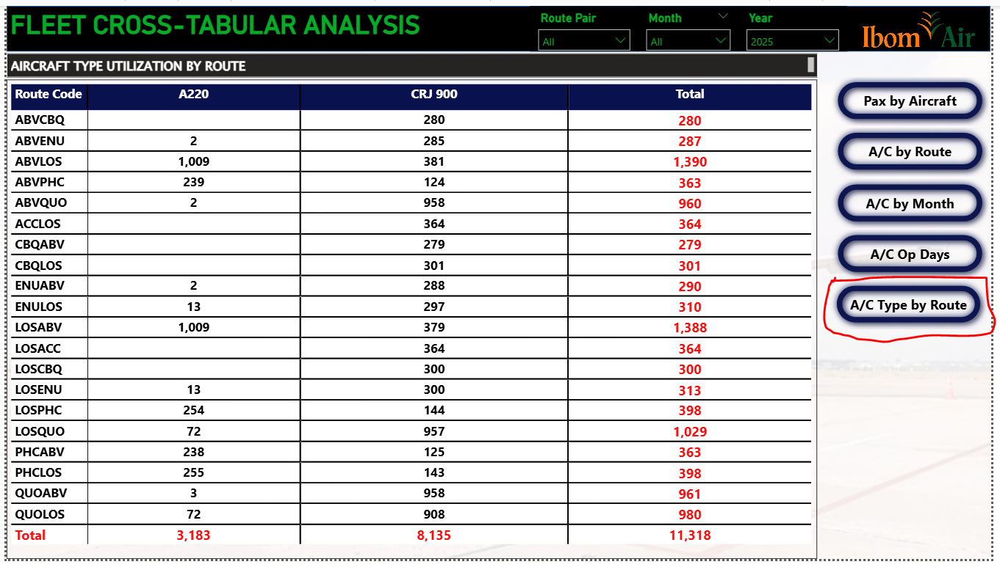

Simplified two-column view showing A220 vs CRJ 900 split per route — the clearest statement of the fleet deployment strategy.

#### Insights surfaced from this visual:

* Only 7 of 20 routes have A220 service: ABV–LOS, LOS–ABV, ABV–PHC, LOS–PHC, PHC–ABV, PHC–LOS, LOS–QUO, QUO–LOS, ABV–ENU, ENU–ABV, LOS–ENU, ENU–LOS. The A220 is strictly deployed on Lagos-origin/destination routes plus a handful of secondary markets.
* ABV–LOS receives the most A220 flights (1,009) — the A220 accounts for 73% of all ABV–LOS operations. This is the core A220 route.
* 13 routes are exclusively CRJ 900: ACC–LOS, CBQ–ABV, CBQ–LOS, and multiple other secondary routes. These routes either have insufficient demand to justify widebody capacity or are structurally sized for the CRJ 900's configuration.
* LOS–PHC has a 254:144 A220:CRJ split, meaning the A220 handles 64% of PHC services — consistent with it being a premium business corridor (Lagos–Port Harcourt oil industry traffic).
* The CRJ 900's dominance at 8,135 vs A220's 3,183 flights highlights the fleet's strategic structure: the A220 maximises yield on high-demand routes, the CRJ 900 maintains network coverage breadth.

#### Fleet Cross-Tabular — Monthly Aircraft Utilisation

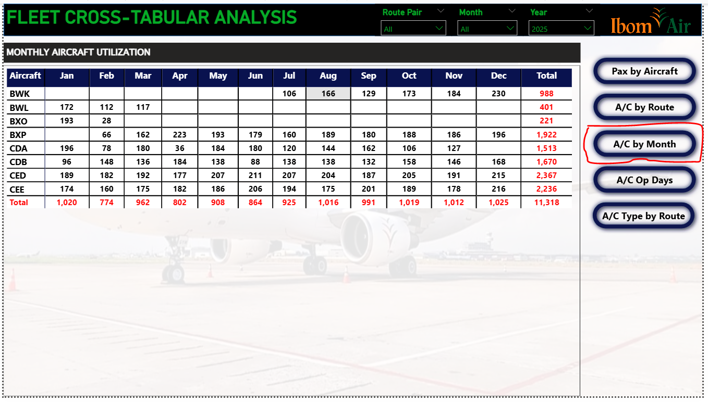

Month-by-month flights operated by each individual aircraft tail number, revealing utilisation intensity, entry/exit dates, and workload distribution across the fleet calendar.

#### Insights surfaced from this visual:

* CED is the most consistently deployed aircraft: operating every single month from January to December, with a high of 215 flights in December and a low of 177 in April. Remarkably consistent across all 12 months — the definition of a core fleet asset.
* CEE mirrors CED's consistency but shows a stronger H2 (206 flights in June, 216 in December) — suggesting it received preferential scheduling as demand picked up in peak season.
* CDA (A220) operated only 11 months — notably missing December entirely, confirming the earlier fleet availability finding that only one A220 was serviceable in December. CDA's absence in December is the most commercially significant single-aircraft gap of the year.
* BWL entered January with 172 flights then rapidly wound down (112 in Feb, 117 in Mar, nothing from April onwards). BXO mirrored this — 193 in Jan, 28 in Feb, gone by March. These two aircraft were clearly transitioned out of the fleet in Q1 2025.
* BWK entered service in July with 106 flights and ramped to 230 in December — the highest single-month count of any aircraft in any month. BWK's December performance partially offset CDA's absence.
* BXP entered February (66 flights) and quickly scaled to full deployment by March (162), stabilising at ~180–196 flights per month for the remainder of the year. Clean, rapid integration of a new asset.
* February 2025 was the lowest utilisation month (774 total) due to the overlap of BWL/BXO wind-down and BXP just entering service — a fleet transition gap that created a structural supply trough.

#### Fleet Cross-Tabular — Aircraft Operating Days

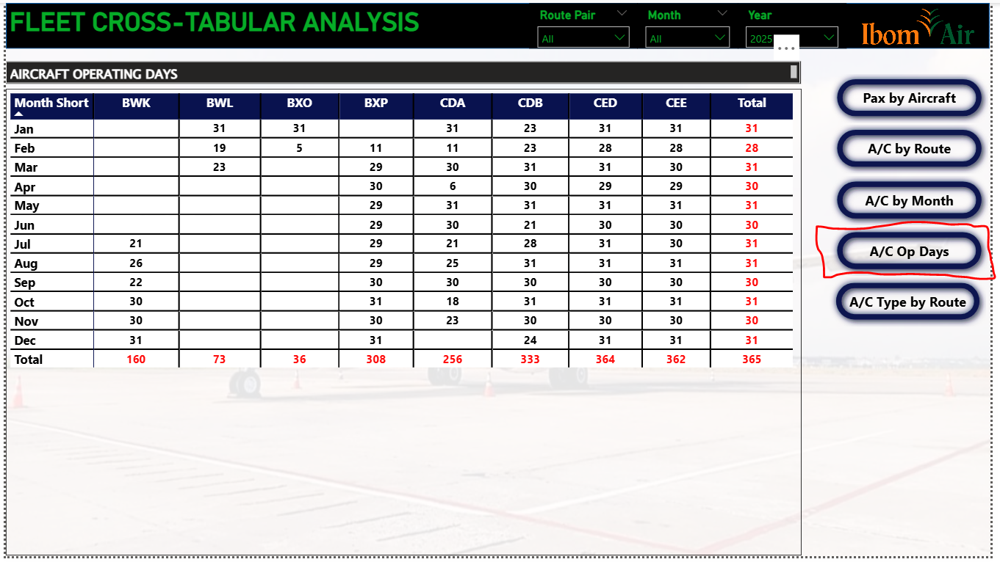

Calendar days each aircraft operated per month, providing a precise measure of physical availability distinct from flight frequency.

#### Insights surfaced from this visual:

* CED and CEE achieved near-perfect operating day records: CED operated 364 days out of 365 (missing only one day in February with 28 vs 31), CEE operated 362. These two aircraft had virtually zero planned downtime beyond scheduled maintenance windows.
* CDB (A220) operated 333 days — slightly below CDA's 256. Wait — CDA only shows 256 operating days while CDB shows 333, yet both were supposed to operate the full year. This confirms CDA had significantly more scheduled maintenance or AOG time (approximately 109 days offline).
* BWK shows 0 operating days from January through June, then 21 in July — confirming it was a new delivery or transfer that entered service in July 2025. By December it operated all 31 days.
* BWL operated only January (31), February (19), March (23) — 73 days total — confirming a Q1 2025 fleet exit. BXO operated January (31) and February (5) — just 36 days total, an almost immediate retirement.
* BXP shows 0 days in January, then 11 in February — entered service mid-February and stabilised at full monthly deployment by March onwards.
* The fleet's combined operating days total 1,892 aircraft-days across 8 active tail numbers — an average of 236.5 operating days per aircraft. Excluding the transitional aircraft (BWL, BXO), the core fleet of 6 averaging ~315 operating days each is an excellent availability metric.

#### Fuel Uplift Analysis

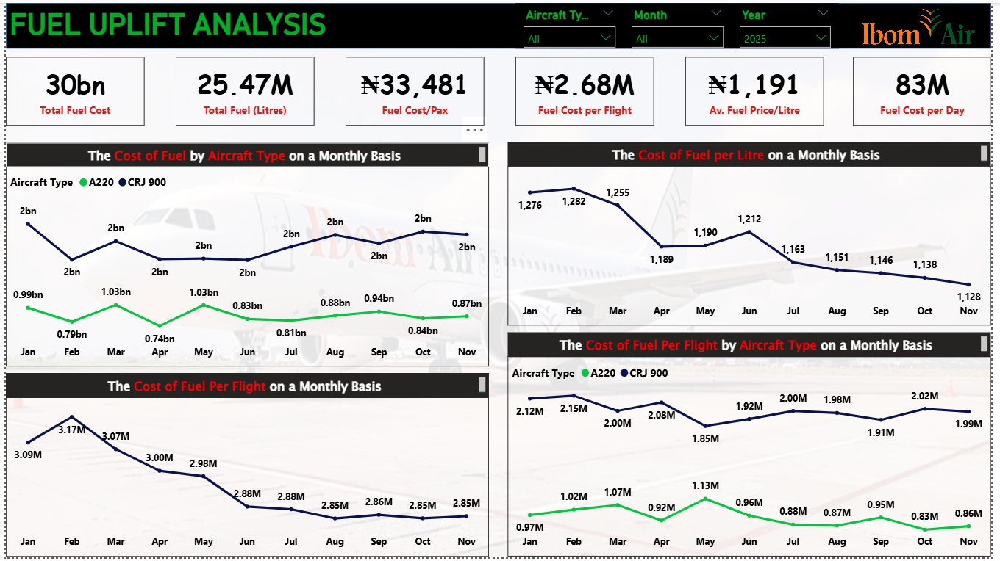

Total fuel metrics (cost, volume, cost per passenger, cost per flight, price per litre, cost per day), monthly cost trends by aircraft type, fuel price per litre trend, and fuel cost per flight trends.

#### Insights surfaced from this visual:

* ₦30bn total fuel cost on 25.47 million litres is the single largest operational cost item in the business. At ₦83M per day, fuel consumes resources at a rate that leaves no margin for operational inefficiency.
* Fuel price peaked in January at ₦1,276/litre and trended downward to ₦1,128/litre by November — a 12% reduction over 11 months. This is a favourable and relatively stable pricing environment, in sharp contrast to the 129% fuel price spike seen in early 2026.
* The CRJ 900 fuel cost is consistently ~2× the A220's monthly fuel spend (e.g., February: CRJ ₦1.99bn vs A220 ₦0.79bn) despite the CRJ operating fewer seat-miles per litre due to the aircraft's lower fuel efficiency relative to the A220's more modern engine technology.
* Fuel cost per flight peaked in January–March (₦3.09M–₦3.17M) and declined through mid-year to ₦2.85M before slight recovery in Q4. The January peak is attributable to both high fuel prices AND higher A220 utilisation in Q1 when both A220s were fully operational.
* The A220 costs ₦0.97M–₦1.13M per flight vs. the CRJ 900's ₦1.85M–₦2.15M per flight — the A220 burns approximately 45% less fuel per flight than the CRJ 900. Given that the A220 also generates nearly double the revenue per flight, the combined economics case for A220 fleet expansion is overwhelming.
* November CRJ 900 fuel cost per flight: ₦1.99M — the lowest of the year, driven by falling fuel prices. This represents the best-case cost baseline for CRJ 900 operations under stable fuel pricing.

#### Fuel Breakdown — Cost vs Revenue

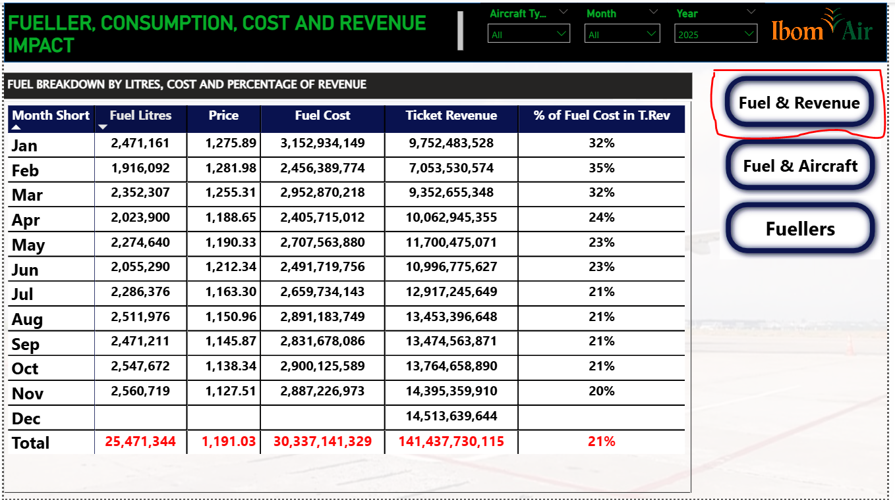

Month-by-month breakdown of fuel litres consumed, price per litre, total fuel cost, ticket revenue, and fuel cost as a percentage of ticket revenue — the definitive financial pressure indicator.

#### Insights surfaced from this visual:

* Full-year fuel cost as % of revenue: 21% — this is actually a healthy ratio for a short-haul African carrier. Industry benchmark for fuel as % of revenue typically runs 20–30% for efficient carriers, placing Ibom Air in a competitive cost position for 2025.
* January–March fuel burden was elevated at 32–35%, driven by the highest fuel prices of the year (₦1,276–₦1,282/litre) combined with lower revenue months. March's revenue of ₦9.35bn against ₦2.95bn fuel cost = 32% — a tight margin.
* The ratio improved dramatically from April (24%) through November (20%) as both fuel prices fell AND ticket revenue grew (November reached ₦14.4bn, the highest monthly revenue in the dataset). This dual improvement — falling costs plus rising revenue — is the ideal operating dynamic.
* December shows ₦14.5bn ticket revenue with no fuel cost recorded — this is a data gap (December fuel data absent), not actual zero consumption. The December fuel figure would complete the full-year picture.
* July–November each achieved 21% fuel ratio — four consecutive months of operational stability. This plateau at 21% represents the floor of achievable fuel efficiency under current fleet and routing conditions.
* Total ticket revenue: ₦141.4bn against ₦30.3bn fuel cost (21%). The remaining ₦111bn must cover crew, maintenance, airport charges, sales costs, overheads, and profit — confirming the critical importance of keeping fuel costs below the 25% threshold.

#### Fuellers Information

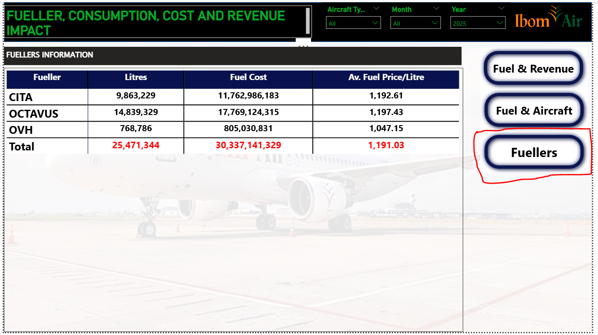

Fuel supply volume, cost, and average price per litre broken down by the three fuel suppliers: OCTAVUS, CITA, and OVH.

#### Insights surfaced from this visual:

* OCTAVUS is the dominant supplier at 14.84M litres (58% of total volume) and ₦17.77bn cost. At ₦1,197/litre average, OCTAVUS charges a modest premium over CITA.
* CITA supplies 9.86M litres (39% of volume) at ₦1,193/litre — virtually identical pricing to OCTAVUS. The near-identical pricing suggests these two suppliers operate in a coordinated market or price their fuel against the same reference benchmark.
* OVH is the most competitive supplier at ₦1,047/litre — ₦150/litre cheaper than OCTAVUS and CITA. However, OVH only supplies 768,786 litres (3% of volume), suggesting airport coverage limitations or contractual volume caps.
* The pricing gap between OVH (₦1,047) and OCTAVUS (₦1,197) = ₦150/litre means that at current volumes, each litre shifted from OCTAVUS to OVH saves ₦150. If even 5 million litres were redirected to OVH pricing, the annual saving would be ₦750M — a material procurement opportunity.
* Total spend: ₦30.34bn across three suppliers — this is a significant procurement relationship. Competitive tendering on the OCTAVUS and CITA contracts at next renewal could generate meaningful cost reductions if OVH or equivalent competitive suppliers can expand coverage to all fuelling stations.

#### Aircraft & Fuel Utilisation

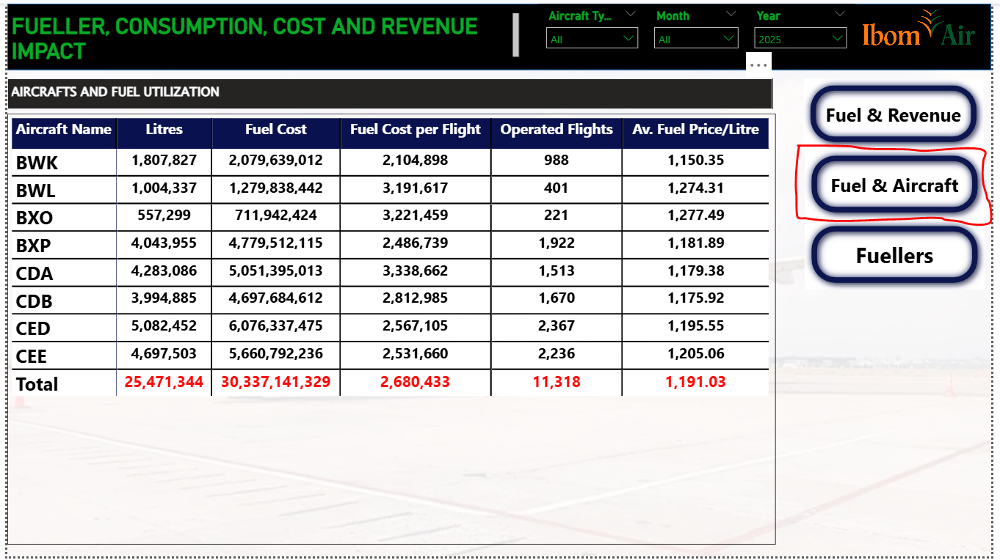

Per-aircraft breakdown of fuel litres consumed, total fuel cost, fuel cost per flight, flights operated, and average fuel price per litre — the definitive aircraft-level efficiency comparison.

#### Insights surfaced from this visual:

* CED consumed the most fuel of any single aircraft: 5.08M litres at ₦6.08bn across 2,367 flights. At ₦2,567,105 per flight, CED is actually more fuel-efficient per flight than BWL or BXO — but its sheer flight volume makes it the largest total consumer.
* BXO is the most expensive aircraft per flight at ₦3,221,459 followed by BWL at ₦3,191,617. Both operated for only 2–3 months and both had the highest average fuel prices (₦1,277 and ₦1,274/litre respectively) — they operated in January–February when fuel was most expensive. This is a price-timing effect, not an aircraft inefficiency issue.
* BWK is the most fuel-efficient CRJ 900 per litre at ₦1,150/litre — the lowest average fuel price of any aircraft. BWK entered service in July when fuel prices had already declined significantly from their Q1 peak. If BWK had operated the full year, its fuel cost per flight would likely be the lowest in the CRJ fleet.
* CDA (A220) consumed 4.28M litres at ₦5.05bn across 1,513 flights = ₦3.34M per flight. CDB consumed 3.99M litres at ₦4.70bn across 1,670 flights = ₦2.81M per flight. CDB is meaningfully cheaper per flight than CDA — likely because CDB operated more frequently in H2 when fuel was cheaper, while CDA's early-year intensity raised its average.
* The CRJ 900 fleet average: ₦2.54M per flight (weighted across CED, CEE, BXP, BWK). The A220 fleet average: ₦3.07M per flight — the A220 burns more fuel per flight in absolute terms (larger aircraft), but generates nearly double the revenue per flight, making it substantially more profitable per seat-kilometre.
* Total fleet fuel efficiency: ₦2.68M per flight average across 11,318 flights. The variance between aircraft (₦2.1M for BWK to ₦3.2M for BXO) demonstrates that route assignment and fuel price timing matter as much as aircraft type in controlling fuel costs.

#### Cargo Operations

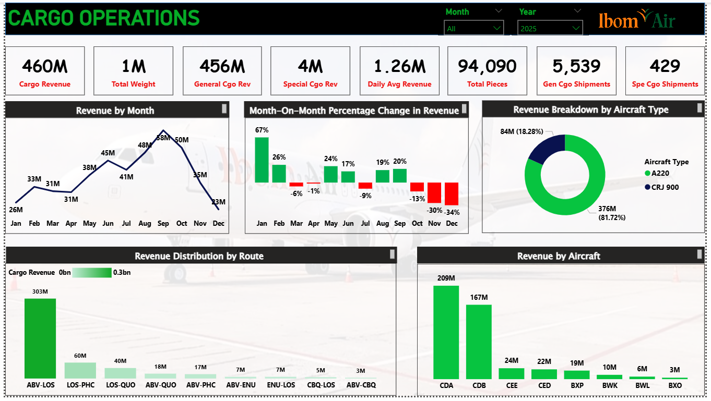

Cargo revenue, weight, shipments, and daily averages; monthly revenue trend with MoM % change; revenue by aircraft type; distribution by route; and revenue by individual aircraft.

#### Insights surfaced from this visual:

* ₦460M total cargo revenue from 94,090 pieces across 5,968 shipments is a modest but real ancillary stream — equivalent to approximately 0.34% of total ticket revenue. There is structural potential to grow this significantly.
* September–October was the cargo revenue peak (₦58M in September, ₦50M in October). The sharp drop in November (₦35M, -30%) and December (₦23M, -34%) is unusual and counter-cyclical — the holiday season typically boosts cargo. This suggests either capacity constraints (A220 offline in December reduces belly cargo hold) or commercial gap in festive cargo marketing.
* January–February showed positive momentum (+67% and +26% MoM) as cargo activity ramped up from a low ₦26M base. The March–April plateau (-6%, -1%) reflects the network-wide Q2 traffic normalisation.
* The A220 generates 81.7% of cargo revenue (₦376M) despite carrying only 28% of flights. This is because the A220 operates on the highest-volume routes (ABV–LOS, LOS–PHC) where cargo demand is densest, and its wider hold provides greater volumetric capacity per flight.
* ABV–LOS dominates cargo revenue at ₦303M (66% of total) — more than 5× the next route (LOS–PHC at ₦60M). The Abuja–Lagos corridor is not just the passenger backbone; it is the cargo backbone too.
* CDA (A220) leads all aircraft at ₦209M followed by CDB (₦167M) — the 56%/44% cargo split between the two A220s is slightly more asymmetric than their passenger revenue split, suggesting CDA is scheduled on more cargo-intensive ABV–LOS rotations.
* BXO generated only ₦3M cargo revenue (operated Jan–Feb only) and BWL generated ₦6M — both marginal. CEE's ₦24M and CED's ₦22M from the CRJ fleet show that belly cargo on the CRJ 900 is meaningful but constrained by hold volume.

#### Flight Delays Analysis

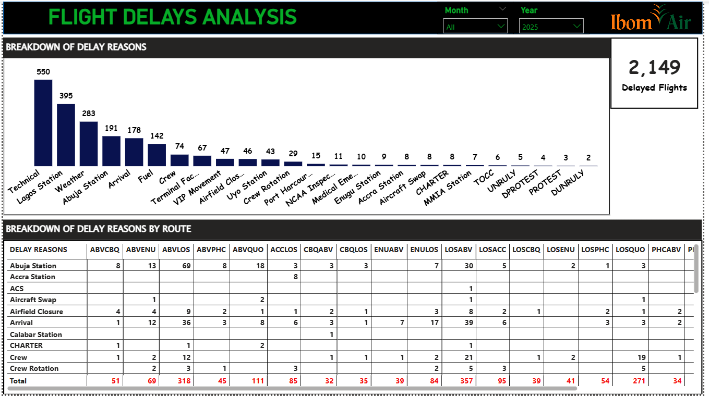

Full-year count of delayed flights (2,149) broken down by 25 delay cause categories, with a route-level cross-tab showing which routes experienced which delay types most frequently.

#### Insights surfaced from this visual:

* Technical faults caused 550 delays (25.6%) — the single largest category, more than weather (283) and Lagos Station congestion (395) combined. For an airline operating a mixed CRJ 900/A220 fleet, technical delays at this frequency signal a maintenance program that is reactive rather than preventive.
* Lagos Station operational issues (395 delays, 18.4%) are the second largest category and are predominantly within the airline's control — ground handling speed, gate allocation, boarding efficiency. This is arguably the most actionable delay category because it does not require aircraft modification or infrastructure investment.
* Weather (283 delays, 13.2%) is the only truly uncontrollable major category. At 13.2%, Ibom Air's weather delay rate is not unusual for Nigerian aviation where harmattan season (November–March) and rainy season (May–October) both create operational disruption.
* Abuja Station (191 delays, 8.9%) is the third-highest station-controllable category, concentrated on ABV–LOS (69 delays from Abuja alone), ABV–QUO (18), and LOSABV (30 delays originating from Abuja). Ground operations at Nnamdi Azikiwe Airport are a persistent pain point.
* Arrival delays (178, 8.3%) — late inbound aircraft causing downstream delay — are a systemic cascading effect. These are not independent events; they are downstream consequences of the Technical and Station delays listed above. Fixing root causes would reduce arrival delays proportionally.
* LOS–ABV received the most delays of any single route: 357 — nearly one-third of all network delays. ABV–LOS had 318. Together, the trunk route pair accounts for 675 delays (31.4% of all delays) despite representing 24.5% of flights. The LOS–ABV route has a disproportionately high delay rate of ~26% (357 delays / 1,388 flights), well above the network average of 19%.
* Fuel-related delays (142, 6.6%) are operationally critical because they are both preventable and dangerous to ignore. The concentration of fuel delays on ABV–LOS (11 delays), LOS–QUO (19 delays), and LOS–ABV (15 delays) points to fuelling throughput bottlenecks at specific airports rather than fuel availability issues.
* Crew-related delays (74 crew + 29 crew rotation = 103 combined) are modest relative to total volume but indicate rostering or positioning inefficiencies that could be addressed through scheduling optimisation.

### Data Model & DAX

#### Star Schema Architecture

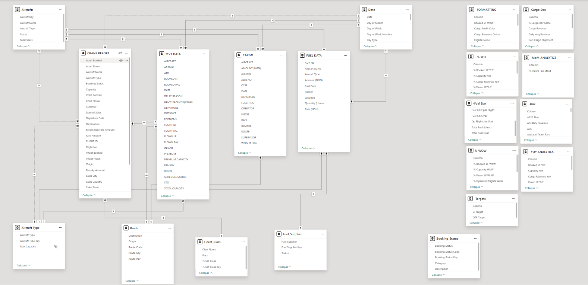

#### Selected DAX Measures

* Total Revenue = SUMX(
'CRANE REPORT',
'CRANE REPORT'[Fare Amount] +'CRANE REPORT'[Surcharge Amount] +
'CRANE REPORT'[SSR Fare Amount] + 
COALESCE('CRANE REPORT'[Penalty Amount],0)
)-[Insurance]

* Total Booked (M) = SUM('MVT DATA'[BOOKED PAX])

* Schedule Reliability = DIVIDE([On Schedule Flights], [Scheduled Flights], 0)

* Serviceable A220 = CALCULATE(
DISTINCTCOUNT('MVT DATA'[Aircraft]),
'MVT DATA'[Aircraft] IN { "CDA", "CDB", "SU-GFA", "SU-GFE", "SU-GFD", "SU-GFG"})

* Serviceable CRJ = CALCULATE(
DISTINCTCOUNT('MVT DATA'[Aircraft]),
'MVT DATA'[Aircraft] IN { "BWK", "BWM", "BWL", "BXP", "BXO", "CED", "CEE" })

* OTP = DIVIDE([On-Time Flights], [Operated Flights])

* On-Time Flights = CALCULATE(
COUNTROWS('MVT DATA'),
'MVT DATA'[Remark] = "On Time")

* Load Factor = 
VAR PaxCarried = SUM('MVT DATA'[FLOWN PAX])
VAR Capacity = SUM('MVT DATA'[Total Capacity])
RETURN
DIVIDE(PaxCarried, Capacity)

* Flown Pax (M) = SUM('MVT DATA'[FLOWN PAX])

* Excess Baggage Revenue = SUMX('CRANE REPORT', 'CRANE REPORT'[Excess Bag Fare Amount])

* Capacity Available = SUM('MVT DATA'[Total Capacity])

* Booked LF = 
VAR BookedPax = SUM('MVT DATA'[BOOKED PAX])
VAR Capacity = SUM('MVT DATA'[Total Capacity])
RETURN
DIVIDE(BookedPax, Capacity)

* Cargo Revenue = SUM('CARGO'[AMOUNT (NGN)])

* Daily Avg Revenue = DIVIDE([Cargo Revenue], DISTINCTCOUNT('Date'[Date]))

* % Cargo Rev MoM = 
VAR CurrentMonth = [Cargo Revenue]
VAR PastMonth = CALCULATE(
[Cargo Revenue],
DATEADD('Date'[Date], -1, MONTH)
)
RETURN
DIVIDE(CurrentMonth-PastMonth, PastMonth, 0)

* Total Fuel Cost = 
SUMX(
'FUEL DATA',
COALESCE('FUEL DATA'[Amount (NGN)], 0))

* Fuel Cost per Flight = 
DIVIDE([Total Fuel Cost], [Operated Flights])

* Av. Fuel Price/Litre = 
DIVIDE([Total Fuel Cost], [Total Fuel (Litres)])

### Technical Stack

| Component                 | Technology  |
|---------------------------|-------------|
|Visualisation & modelling  |Power BI Desktop |
|Data transformation        |Power Query |
|Calculations               |DAX |
|Data model                 |Star schema |
|Security                   |Row-Level Security by station |
|Interactivity              |Bookmarks · Drill-through · Cross-filter · Dynamic slicers |
|Deployment                 |Power BI Service |
|Insights                   |Grok . Claude AI . CoPilot |

### Author
#### Udemeabasi Ekong
* Data Analyst · Power BI Developer · Aviation Domain Analytics

* LinkedIn: www.linkedin.com/in/udemeabasi-ekong-973344157
* Email: udemeabasi6@gmail.com
